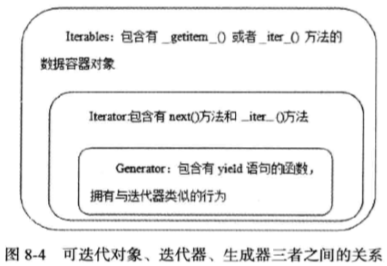

### 一、引论

#### 1 理解pythonic概念

体现出python特色的代码风格。比如，(1) `a,b = b,a`  (2) `with open() as f`  (3) `for i in list` (4) 用str.format 代替%

#### 2 编写pythonic代码

全面掌握python的语言特性和库特性，写代码时就会以常见的，公认的，简短的惯用法来达到预期效果。常用的风格检测程序，PEP8，Pychecker(google推荐)，Pylint(方便配置风格)，Pyflakes(易于集成到vim)

#### 3 理解python与C的不同之处

缩进取代{}，单双引号几乎无区别，if else取代三元运算符，没有switch case。

#### 4 添加适当注释

给函数和方法添加docstring，功能，参数类型以及参数用途，返回类型以及返回值的描述。

推荐在文件头添加copyright声明，模块描述。不用的代码应该被删掉，不应该注释掉。

#### 5 添加适当空行

分号和逗号前不加空格，函数默认参数两侧不需要空格。

#### 6 编写函数的4个原则

尽量短小，不宜嵌套过深，不过一屏；参数应该简洁；向下兼容；一个函数只做一件事。（除此之外，不要用可变对象作为默认参数，使用异常代替返回错误，保证通过单元测试）

#### 7 将常量集中到一个文件

python中没有提供定义常量的直接方式，可以通过自定义类来实现，在`__setattr__`中设置判断。定义的常量一般放到同一个文件，例如constant.py，用时import就可以。

### 二、惯用编程法

#### 8 利用assert来发现问题

不要滥用；可以作为异常捕获就不要用断言；不要用断言检查用户输入，应该用田间判断；确认函数返回值是否合理可以用断言；当某条件是业务逻辑进行下去的先决条件时可以用断言。

#### 9 数据交换值不推荐使用中间变量

a,b = b,a这种方式更快。

#### 10 充分利用lazy evaluation特性

惰性计算，例如短路求值，yield，生成器。

#### 11 理解枚举替代实现的缺陷

python3.4前没有枚举类型。通过类属性，函数，命名元组登代替。

#### 12 不推荐type来进行类型检查

基于内建类型扩展的用户自定义类型，type函数不能返回正确结果（如A继承自int，type(a) is types.intType 返回false）；所有古典类的实例的type都相同，<type 'instance'>。用isinstance函数代替。

#### 13 尽量转为浮点型再做除法

float()函数；在python3之前可以`from __future__ import division`使除法不截断。python3.0之后不存在问题。浮点数有时也是不准确的，精度要求高的地方可以用decimal，避免将浮点数用在条件表达式中(如 i==1.5)。

#### 14 警惕eval()的安全漏洞

如果使用对象不是信任源，尽量避免eval，比如用eval执行`__import__("os").system("dir")`会拿到当前目录下的内容。当然可以通过设置eval的globals参数来避免，如`eval(string, {“__builtins__":None},local_dict)`。但是有些语句无法避免，如：

`[c for c in ().__class__.__basess__[0].__subclasses__() if c.__name__=='Quitter'][0](0)()`会导致python解释器退出。解决办法是用ast.literal_eval来代替eval。

#### 15 使用enumerate获取序列的索引和值

enumerate(sequence, start=0)，返回迭代器。

#### 16分清is和==的适用场景

一般情况下`a is b`成立，则`a == b`成立（特殊情况除外，如`a=float('NaN')`，`a is a`为true，`a == a`为false）。

#### 17 尽可能使用unicode提升兼容性

bom头可以表示大小端编码（FEFF表示大端，FFFE表示小端）和编码方式（比如utf-8用EFBBBF表示）。python2.6后可以`from __future__ import unicode_literals`来使默认字符串识别为unicode，与python3一致。 **<u>utf-8用字节来编码，一般不需要BOM来表明字节顺序。</u>**

#### 18 构建合理的包层次来管理module

 如果`__init__.py`文件为空，则用`from package import *`并不能使导入的模块生效，因为不同平台间的文件命名规则不同，python解释器不能正确判断模块在对应平台如何导入，因此它仅仅执行`__init__.py`。在其中加上`__all__即可控制要导入的模块或子包。`

### 三、基础语法

#### 19 有节制的使用from...import 语句

* from A import a会将A加到sys.modules中(和import A一样)，但a会直接暴露到当前局部命名空间。

* from...import循环嵌套导入时会ImportError，直接使用import则不会。

#### 20 优先使用absolute import来导入模块

显示使用相对导入(加 . 或 ..)时可能会遇到ValueError: Attempted relative import in non-package，是由于在包的内部运行脚本时，包的结构信息会丢失。

https://blog.csdn.net/chinaren0001/article/details/7338041

https://www.cnblogs.com/jiaxin359/p/7580375.html

可以加上-m参数以模块的方式运行；或者修改`__package__`属性。

#### 21 i+=1不等于++i

python中没有自增操作，++i的+表示正号。++++i == i。同理---i == -i，--i == i。

#### 22 使用with自动关闭资源

实现`__enter__()`和`__exit()__`方法（上下文协议）的对象都是上下文管理器。文件打开关闭，连接和断流，锁分配等。python中的contextlib模块中的contextmanager作为装饰器提供针对函数级别上的上下文管理机制。

#### 23 使用else子句简化循环（异常处理）

在while或for语句没有break，正常结束时，else语句被调用。try语句没发生异常时，else语句被调用。
```python
try:
    db.execute()
except SQLError:
    db.rollback()
else:
    db.commit()
```

#### 24 异常处理 的几个基本原则

不要再try中放入过多的代码；尽量不要用单独的except捕获所有异常；注意异常的捕获顺序，子类异常一般放在前面；遵守异常参数规范。

#### 25 避免finally中的陷阱

（1）在try中发生异常时，如果在except中找不到对应异常处理，异常被临时保存，当finally执行完后会将该异常再次抛出。但，若finally中执行了break或return或产生了新的异常，则原异常丢失。

（2）finally语句会在try语句中的return语句前执行。

#### 26 深入理解None，正确判断对象是否为空

None不是0，不是空字符串，不是空列表，也不是false。是NoneType类型的单例。在语句if a中，会调用a的`__nonzero__()`方法来判断a是否为空(比如list)，如果不存在则调用`__len__()`方法，返回0表示空。如果这两个方法都没定义，则该类实例用if判断的结果都为true。

#### 27优先用join而不是+连接字符串

join的效率要高得多。因为字符串是不可变对象，str1+str2需要将两个而字符串各复制一遍放到新的空间。

#### 28 格式化字符串尽量用format而不是%

format更灵活；format可作为参数传递；%最终会被format代替；如果要格式化元组需要加逗号，如`t=(1,2,3)`,`print  "tuple is %s" % (t,)`。format则不需要，`print "tuple is {}".format(t)`。

#### 29 区别对待可变对象和不可变对象

切片操作相当于浅拷贝。

#### 30 [], (), {}一致的容器初始化形式

元组初始化时，（1）和（1，）不同。

#### 31 函数传参既不是传值也不是传引用

正确说法是传对象，对可变对象的修改在函数内外都可见，而不可变对象在内部修改不会影响外部。

对于这种情况，虽然a和testlist指向同一个对象，但之后testlist指向了一个新的对象，所以a不变。

```
def func(testlist):
    testlist = []
a = [1,2,3]
func(a)
print a
```

#### 32 默认参数存在的问题

默认参数存在函数的func_defaults属性中，python中参数穿的是对象，所以如何默认参数是可变对象，并在函数在被修改，那下次调用时默认参数就变了。

#### 33 慎用变长参数

函数调用方式过于灵活；变长参数用在为函数添加一个装饰器；参数个数不确定，如读取配置文件。

#### 34 深入理解str()和repr()的区别

* str面向用户，目的是可读，repr面向编程人员，用作debug，目的是准确。

* 解释器里直接输入对象调用的是repr，输入print 对象，调用的是str。对于内置类型，一般`obj == eval(repr(obj))`，这俩个方法分别调用内建的`__str__()`和`__repr__`方法，所以用户实现`__repr__`时最好保证其返回值可以用eval()方法使对象重新还原。

* 如果没有定义`__str__`，则会默认使用`__repr__`的结果来作为对象的字符串表示形式(如print obj，若实例obj对应的类没定义`__str__`,就会调用`__repr__`)。

#### 35 分清classmethod和staticmethod的适用场景

* 继承中，父类定义了类变量，同时定义了一个方法修改该类变量，如果子类想要修改自己的类变量而不是父类中的，需要使用类方法。

```python
class Fruit:
    total = 0
    @classmethod
    def setTotal(cls, val):
        cls.total = val

class Apple(Fruit):
    pass

class Banana(Fruit):
    pass

app1 = Apple()
app2 = Apple()
ban1 = Banana()
app1.setTotal(1)
ban1.setTotal(2)
print app2.total    # output 1
print Banana.total  # output 2
```


* 另一种必须要用classmethod的情景。

```python
class Fruit:
    def __init__(self, price, name):
        self.name = name
        self.price = price

    @classmethod
    def init_fruit(cls, info):
        price, name = info
        fruit = cls(price, name)
        return fruit

class Apple(Fruit):
    pass

class Banana(Fruit):
    pass


a = Apple.init_fruit(['$3','apple'])
print isinstance(a, Fruit)   # True
print isinstance(a, Apple)   # True

```

* 个人认为，python中能用静态方法的地方都能用类方法。当然方法与特定类无关最好还是用静态方法。

### 四、库

#### 36 字符串的基本用法

* basestring是str和unicode的基类，所以判断某个对象a是否是字符串时，用`isinstance(a,basestring)`。
* startswith和endswith函数可以接收元组，当与其中某个元素匹配返回True。也接受start和end参数，`s.startswith(tuple or str, start, end)` 相当于 `s[start:end].startswith(tuple or str)`。
* split第二个参数是最大分割次数，`'12/34/567/89'.split('/',2) == ['12','34','567/89']`。
* `‘hello  world’.split() == ['hello', 'world']`，不带参数的split以变长的空格为sep(即连续的空白被当作单一的空白)，而带参数的split会认为连续的sep间存在空字符串，并且如果sep是首或尾时也会加上一个空字符串。`‘/123///111/’.split('/') ==['','123','','','111','']`
* 还有一些string的方法在string模块中，https://blog.csdn.net/bc_vnetwork/article/details/51781157

#### 37 按需选择sort和sorted

* `sorted(iterable[, cmp[, key[, reverse]]])`; 

* `s.sort([cmp[, key[, reverse]]])`;

* 一般sort只针对list，sorted可用于任意可迭代对象。

* sort返回None，修改原有列表；sorted返回排序后的列表，原列表不受影响。sort消耗内存少，效率较高。

* 使用key比cmp效率要高；

* from operator import itemgetter；配合itemgetter可方便对复合对象排序(如字典中混合list)。

  `a = [1,2,3];  get = itemgetter(1,0);  get(a)  >>> (2, 1)`

#### 38 使用copy模块深拷贝对象

在拷贝含有可变对象的数据结构时，一般要用深拷贝。copy.deepcopy。

#### 39 使用Counter进行计数统计

from collections import Counter；Counter是字典的子类。有三种初始化方式，可迭代对象，关键字参数和字典

`Counter('success') == Counter(s=3,c=2,e=1,u=1) == Counter({"s":3, "c":2, "u":1, "e":1})`。

```python
from collections import Counter
a = Counter('success')
print list(a.elements())  # 获取Counter中key的值，重复 ['e', 's', 's', 's', 'u', 'c', 'c']
print a.keys()  #获取Counter中key的值，不重复 ['e', 's', 'u', 'c']
print a.most_common(2)  # 打印前N个出现频率最高的元素以及次数 [('s', 3), ('c', 2)]
print a.update("sss")   # 更新原对象，新旧元素统计计数相加而不是替换 Counter({'s': 6, 'c': 2, 'e': 1, 'u': 1})
print a.subtract('uuu')  # 更新原对象，旧元素剪掉新元素次数，允许0或负 Counter({'s': 6, 'c': 2, 'e': 1, 'u': -2})
print a['2']   # 访问不存在的元素时不抛出异常，而是返回0
```

#### 40 深入掌握ConfigParser

用于读取或修改配置文件。

https://blog.csdn.net/miner_k/article/details/77857292

https://blog.csdn.net/shortwall/article/details/78615368

#### 41 使用argparse处理命令行参数

* getopt比较原始，编写和维护比较困难。optparse相对较好，argparse更优。
* argparse介绍：https://blog.csdn.net/guoyajie1990/article/details/76739977

#### 42 使用pandas处理大型csv文件

* csv模块简单易用，主要有writer，reader，DictReader，DictWriter等方法，具体参考https://yiyibooks.cn/xx/python_352/library/csv.html。但对于较大的文件（超过几百M），会报出MemoryError异常。
* Pandas（Python Data Analys Library）提供丰富的数据模型以及多种文件格式处理。其中支持高效的大型数据处理的数据结构是Series和DataFrame。Series是类似数组的带索引的一维数据结构，与NumPy兼容。DataFrame，类似一个二维数据结构，支持行和列索引。pandas提供read_csv和write_csv，read_csv（）返回的是DataFrame，write_csv是其逆过程。
* Series：http://pandas.pydata.org/pandas-docs/stable/generated/pandas.Series.html
* DataFrame：http://pandas.pydata.org/pandas-docs/stable/generated/pandas.DataFrame.html

#### 43 一般情况使用ElementTree解析XML

* 当xml文件近似GB级，用第三方模块lxml会获得较优的结果。
* https://yiyibooks.cn/xx/python_352/library/xml.etree.elementtree.html

#### 44 理解pickle的优劣

* 优点：

1. 存储格式具有通用性，兼容性好，linux下序列化的文件能在windows上反序列化；

2. 可扩展，古典类中，unpickle时，把`__getinitargs__`函数返回的元组作为参数传给`__init__`，新式类则是`__getnewargs__`，在unpickle时以`Class.__new__（Class, *args）`的方式创建对象；

3. 对于不可序列化的对象(sockets，文件句柄，数据库连接等)，可以通过实现pickle协议来解决。主要通过`__setstate__()`和`__getstate__()`，如下：
```python
import cPickle as pickle

class TextReader:
    def __init__(self, filename):
        self.filename = filename
        self.file = open(filename)
        self.position = self.file.tell()
    def __getstate__(self):
        state = self.__dict__.copy()
        del state["file"]
        return state
    def __setstate__(self, state):
        self.__dict__.update(state)
        file = open(self.filename)
        self.file = file

```
4. 能够维护对象间的引用

* 缺点：
1. 不能保证原子性，如果调用中途发生异常，可能只保存了部分数据；
2. 安全性问题，`pickle.loads("cos\nsystem\n(S'dir'\ntR.")`,这句话可以查看当前目录下所有文件，可以继承类pickle.Unpickler并重写find_class()方法；
3. pickle协议是python特定的，不同语言不兼容。

#### 45 序列化的另一个选择--json

json仅存在俩种数据结构：键值对的集合，值的有序列表。

提供了JSONEncoder和JSONDecoder对不支持序列化的类型进行扩展。

#### 46 使用traceback获取栈信息

* 在except语句中使用traceback.print_exc()输出异常发生时候的完整信息，包括调用顺序，异常发生的语句，错误类型等。常用的几个函数有：
1. traceback.print_exception(type, value, traceback[, limit[, file]])，limit限制打印堆栈的深度，file为None的情况下定位带std.err，否则写入文件。type为异常类型，value为异常本身，traceback为异常发生时的调用和堆栈信息。
2. traceback.print_exc([limit[], file])，与1类似，不需要前面三个参数，这三个参数对应的值可以从sys.exc_info()中获取。
3. traceback.format_exc([limit])，与2类似，区别在于返回形式为字符串。
4. trackback.extract_stack([file[, limit]])，从当前栈中提取trace信息。
*  处理traceback模块，inspect模块也提供了获取traceback对象的接口。inspect.trace([context])返回当前帧对象到异常发生时进行捕获的帧对象之间的所有栈帧记录列表，所以第一个记录代表当前调用对象，最后一个代表异常发生时候的对象。列表的每一个元素都是一个六元组，（frame对象，文件名，当前行号函数名，源代码列表，当前行在源代码列表中的位置）。

#### 47 使用logging记录日志信息

https://www.cnblogs.com/CJOKER/p/8295272.html

#### 48 使用threading模块编写多线程程序

* 由于GIL(全局解释器锁)，他保证一个时刻只有一个线程可以执行代码。https://blog.csdn.net/liangkaiping0525/article/details/79490323

* thread模块提供了多线程底层支持模块，以低级原始的方式来处理和控制线程，使用起来较为复杂；threading模块基于thread模块进行包装，将线程操作对象化，在语言层面提供了丰富的特性。实际应用中，优先使用threading。其对同步原语的支持更完善和丰富，在主子线程交互上更友好（比如threading才有守护线程，通过setDeamon方法设置），py3k中Thread模块改名为_thread。

* 创建线程的两种方式：

  继承Thread类，重写run方法。

  创建threading.Thread对象，在其__init__函数中将可调用对象作为参数传入。

  https://www.cnblogs.com/chengd/articles/7770898.html

#### 49 使用Queue使多线程编程更安全

* queue模块的内容：

1. class queue.Queue(maxsize = 0)构造一个FIFO队列，maxsize可以限制队列的大小。如果队列的大小达到了队列的上限，就会加锁，加入就会阻塞，直到队列的内容被消费掉。maxsize的值小于等于0，那么队列的尺寸就是无限制的

2. class queue.LifoQueue(maxsize = 0)构造一个Lifo队列

3. class PriorityQueue(maxsize = 0)优先级最低的先出去，优先级最低的一般使用`sorted(list(entries))[0]`)。典型加入的元素是一个元祖(优先级, 数据)。

    Queue.qsize() ：返回queue的近似值。注意：qsize>0 不保证(get)取元素不阻塞。qsize< maxsize不保证(put)存元素不会阻塞

* Queue对象方法：

1. Queue.empty():判断队列是否为空。和上面一样注意。

2. Queue.full():判断是否满了。和上面一样注意。

3. Queue.put(*item*, *block=True*, *timeout=None*): 往队列里放数据。如果满了的话，blocking = False 直接报 Full异常。如果blocking = True，就是等一会，timeout必须为 0 或正数。None为一直等下去，0为不等，正数n为等待n秒还不能存入，报Full异常。

4. Queue.put_nowait(item):往队列里存放元素，不等待

5. Queue.get(*item*, *block=True*, *timeout=None*): 从队列里取数据。如果为空的话，blocking = False 直接报 empty异常。如果blocking = True，就是等一会，timeout必须为 0 或正数。None为一直等下去，0为不等，正数n为等待n秒还不能读取，报empty异常。

6. Queue.get_nowait(item):从队列里取元素，不等待。

   以下两个方法跟踪入队的任务是否被消费者daemon进程完全消费

7. Queue.task_done()表示队列中某个元素呗消费进程使用，消费结束发送的信息。每个get()方法会拿到一个任务，其随后调用task_done()表示这个队列，这个队列的线程的任务完成。就是发送消息，告诉完成啦！如果当前的join()当前处于阻塞状态，当前的所有元素执行后都会重启（意味着收到加入queue的每一个对象的task_done()调用的信息）。如果调用的次数操作放入队列的items的个数多的话，会触发ValueError异常。

8. Queue.join()一直阻塞直到队列中的所有元素都被取出和执行。未完成的个数，只要有元素添加到queue中就会增加。未完成的个数，只要消费者线程调用task_done()表明其被取走，其调用结束。当未完成任务的计数等于0，join()就会不阻塞

```python
import threading
import Queue

class DownloadThread(threading.Thread):
    def __init__(self, queue):
        threading.Thread.__init__(self)
        self.queue = queue
    def run(self):
        while True:
            url = self.queue.get()
            print "begin download "+url
            self.download_file(url)
            self.queue.task_done()
    def download_file(self, url):
        # do something
        pass

if __name__ == "__main__":
    urls = ["url1","url2","url3","url4","url5"]
    queue = Queue.Queue()
    for i in range(5):
        t = DownloadThread(queue)
        t.setDaemon(True)
        t.start()
    for url in urls:
        queue.put(url)
    queue.join()

```

https://www.shellcodes.org/Python/Queue%E9%87%8Ctask_done%E6%96%B9%E6%B3%95%E4%BD%BF%E7%94%A8%E6%B3%A8%E6%84%8F.html

http://www.vuln.cn/8610

### 五、设计模式

#### 50 利用模块实现单例模式

```python
import threading

class Singleton(object):
    objs = {}
    objs_locker = threading.Lock()
    def __new__(cls, *args, **kv):
        if cls in cls.objs:
            return cls.objs[cls]
        cls.objs_locker.acquire()
        try:
            if cls in cls.objs:   # double checking lock
                return cls.objs[cls]
            cls.objs[cls] = object.__new__(cls)
        finally:
            cls.objs_locker.release()

```

上面这个方案依旧存在两个问题：

1. 如何Singleton的子类重载了`__new__()`方法，会覆盖或者干扰Singleton类中`__new__()`的执行，虽然出现的概率极小。
2. 如果子类有`__init__()`方法，那么每次实例化Singleton的时候，`__init__()`都会被调用到，这显然是不应该的，`__init__()`只应该在创建实例的时候被调用一次。

然而这并不pythonic。利用模块（变量绑定到模块，模块只初始化一次，import机制是线程安全的）。

#### 51 用mixin模式让程序更加灵活

每个类都有一个__bases__属性，是一个元组，用来存放所有的基类。与其他静态语言不同，python中基类在运行中可以动态改变，当增加了新的基类时，类就用于了新的方法，这就是混入(mixin)。

```python
def simple_tea_people():
    people = People()
    people.__bases__ += (UseSimpleTeapot, )
    return people
def tea_and_coffe_people():
    people = People()
    people.__bases__ += (UseSimpleTeapot, UseCoffeepot, )
    return people
```

#### 52 用发布订阅模式实现松耦合

https://blog.csdn.net/gzlaiyonghao/article/details/7215315

#### 53 用状态模式美化代码

通过state模块实现状态模式更方便，pip install state。

被@stateful修饰的类是有状态的，使得该类能访问调用当前状态类的方法。能用curr()查询当前状态，用`switch()`切换状态，default定义默认状态。

```python
from state import curr, switch, stateful, State, behavior

@stateful
class People(object):
    class Workday(State):
        default = True
        @behavior
        def day(self):
            print 'work'
    class Weekend(State):
        @behavior
        def day(self):
            print 'play'

people = People()
while True:
    for i in range(1, 8):
        if i == 6:
            switch(people, People.Weekend)
        if i == 1:
            switch(people, People.Workday)
        people.day()
```

### 六、内部机制

#### 54 理解built-in objects

```python
class A:    
    pass
class B(object):
    pass
class C(type):
    pass
class D(dict):
    pass
```


object和古典类没有基类，新式类的type和`__class__`是一样的。

继承自内建类型的用户类的**实例**也是object的**实例**，object是type的实例，type是个元类（实例是object的实例）

object和内建类型以及所有基于type构建的自定义**类**都是type的**实例**（类是type的实例）

object和type的关系：https://segmentfault.com/a/1190000008938763  

https://www.cnblogs.com/busui/p/7283137.html?utm_source=itdadao&utm_medium=referral

```python
class A:
    def f(self):
        pass
class B(object):
    def f(self):
        pass
class C(B):
    pass
class D(A):
    pass
	
type(A)   #  <type 'classobj'>	
type(B)   #  <type 'type'>
type(C)   #  <type 'type'>
type(D)   #  <type 'classobj'>

type(A())  #  <type 'instance'>
type(B())  #  <class '__main__.B'>
type(C())  #  <class '__main__.C'>
type(D())  #  <type 'instance'>

A().__class__  #  <class __main__.A at 0x0000000002C39828>
B().__class__  #  <class '__main__.B'>
C().__class__  #  <class '__main__.C'>
D().__class__  #  <class __main__.D at 0x00000000034D3AC8>

# 控制台直接输出或print一个类对象obj，相当于obj().__class__
>>> A   <class __main__.A at 0x0000000002C39828>
>>> B   <class '__main__.B'>
>>> C   <class '__main__.C'>
>>> D   <class __main__.D at 0x00000000034D3AC8>

>>> A()  <__main__.A instance at 0x00000000034F0C08>
>>> B()  <__main__.B object at 0x00000000034EBC50>
>>> C()  <__main__.C object at 0x00000000034EBC88>
>>> D()  <__main__.D instance at 0x00000000034F0C08>
```

#### 55 `__init__()`不是构造方法

* `object.__new__(cls [, args])`：cls代表类，是静态方法。控制实例的创建。

  `object.__init__(self [, args])：`self代表实例对象，是实例方法。控制实例的初始化。

  `__new__()`方法一般需要返回类的对象，返回类的对象时会自动调用`__init__()`方法，如果没有返回则不会调用`__init__()`方法`__init__()`方法默认返回None，否则会抛出TypeError。

* 如果需要覆盖这两个方法时这两个方法的参数必须保持一致（在使用上都可接受即可，比如`__init__(self, arg)`和`__new__(cls, *args)`在调用时都只传入一个参数则不会有异常），否则会抛出TypeError。

* 子类需要显示调用父类的这两个方法如果需要的话。以`__init__()`为例：

  单继承情况下：`父类.__init__(self, arg)` 和 `super(子类， cls).__init__(arg)` 效果相同；多继承情况下：需要迭代子类的`__bases__`属性逐一调用`父类.__init__(self, arg)`，而super只需要调用一次。

* 需要覆盖`__new__()`的特殊情况：

1. 继承自不可变类型（str，int，unicode，frozenset，tuple）且默认`__new__()`不能满足需求。实际上不可变类型的`__init__()`方法是个伪方法。
```python
class User(frozenset):
    def __init__(self, arg=None):
        arg = arg.split()
        super(User, self).__init__(self, arg)
print User("i am a string")     # User(['a', ' ', 'g', 'i', 'm', 'n', 's', 'r', 't'])

class User(frozenset):
    def __new__(cls, *args):
        args = (args[0].split(),)
        return super(User, cls).__new__(cls, *args)
print User("i am a string")     # User(['i', 'a', 'am', 'string'])
```
2. 元类编程或实现工厂模式、单例模式。

#### 56 理解名字查找机制

有关命名空间和作用域的一些解释参考印象笔记。

变量名的查找遵循LEGB法则。py3k中引入的nonlocal关键字可以解决闭包中可能出现UnboundLocalError异常。

#### 57 为什么需要self参数

`A.__dict__['f']`和`A.f.__func__`都可以直接访问类中的方法（作为普通方法使用）。

#### 58 理解MRO与多继承

古典类和新式类所采取的MRO的实现方式存在差异。（新式类采用的是C3 MRO），新式类可通过`__mro__`获取类的MRO。

古典类：按照继承的声明顺序从左至右深度优先搜索。

新式类：

我们把类 C 的线性化（MRO）记为 L[C] = [C1, C2,…,CN]。其中 C1 称为 L[C] 的头，其余元素 [C2,…,CN] 称为尾。如果一个类 C 继承自基类 B1、B2、……、BN，那么我们可以根据以下两步计算出 L[C]：

```
L[object] = [object]
L[C(B1…BN)] = [C] + merge(L[B1]…L[BN], [B1]…[BN])
```

这里的关键在于 merge，其输入是一组列表，按照如下方式输出一个列表：

1. 检查第一个列表的头元素（如 L[B1] 的头），记作 H。

2. 若 H 未出现在其它列表的尾部，则将其输出，并将其从所有列表中删除，然后回到步骤1；否则，取出下一个列表的头部记作 H，继续该步骤。

3. 重复上述步骤，直至列表为空或者不能再找出可以输出的元素。如果是前一种情况，则算法结束；如果是后一种情况，说明无法构建继承关系，Python 会抛出异常。

   示例：A:object，B:A，C:A，D:BC。

   L(O) = O

   L(A) = A,O

   L(B) = merge(L(A)) = B + merge(AO) = B,A,O

   L(C) = merge(L(A)) = C + merge(AO) = C,A,O

   L(D) = D + merge(L(B), L(C), BC) = D + merge(BAO, CAO, BC) = D + B + merge(AO, CAO, C) = D+ B+ C+ merge(AO, AO) = D,B,C,A,O

注意：继承不要违反单调性原则（见参考），否则会抛出异常；继承也应该尽量避免菱形继承。

参考：https://www.cnblogs.com/whatisfantasy/p/6046991.html

#### 59 理解描述符机制

* python描述符是一个“绑定行为”的对象属性，在描述符协议中，它可以通过方法重写属性的访问。这些方法有 `__get__()`, `__set__()`, 和`__delete__()`。如果这些方法中的任何一个被定义在一个对象中，这个对象就是一个描述符。（个人理解）

* 描述符是一个类属性，必须定义在类的层次上，而不能单纯的定义为对象属性。

* `type.__getattribute__()`（访问属性时无条件调用，最先调用），如果x是描述符，它能把`Class.x`转换成`Class.__dict__[‘x’].__get__(None, Class)`，

  `obj.__getattribute__()`会将`myclass.x`转换为`type(myclass).__dict__['x'].__get__(myclass, type(myclass))`

优先级：`__getattribute__`()>数据描述符>实例属性>类属性>非数据描述符>父类属性>`__getattr__()`；

通过ins.`__dict__`访问实例属性只查找实例属性；而.操作符会依次查找实例属性，类属性，父类属性，描述符。

装饰器（staticmethod，property，classmethod等）都用到了描述符。

参考印象笔记 描述器，以及 https://www.cnblogs.com/Jimmy1988/p/6808237.html  和 

https://www.jianshu.com/p/27deebdd521f

#### 60 区别`__getattr__()`和`__getattribute__()`方法

涉及到实例（类属性不涉及）属性访问`__getattribute__()`总是会被调用（要么返回值，要么抛出异常，仅应用于新式类），`__getattr__()`在`__getattribute__()`或property抛出AttributeError时调用。

* 在覆盖这两个方法时避免无穷递归。例如：

```python
class A(object):
    def __getattribute__(self, attr):
        try:
            return self.__dict__[attr]
        except KeyError:
            return "default"
```

即使将`self.__dict__[attr]`替换成`self.__getattribute__(self, attr)`或`getattr(self, attr)`也不行。正确做法是`super(A, cls).__getattribute__(attr)`或`object.__getattribute__(self, attr)`。

* `__getattr__()`如果不抛出ttributeError异常或返回一个值时，则会返回None。

#### 61 使用更为安全的property

俩种property的适用形式：

```python
class A(object):
    def __init__(self):
        self._val = 0
    def get_val(self):
        return self._val
    def set_val(self, value):
        self._val = value
    def del_val(self):
        del self._val
    val = property(get_val, set_val, del_val, "I'm val")
```

```python
class B(object):
    def __init__(self):
        self._val = 0
    @property
    def val(self):
        return self._val
    @val.setter
    def val(self, value):
        self._val = value
    @val.deleter
    def val(self):
        del self._val
```

注意：上面例子中，_val不能写成val，否则会无限递归。

* 如果只实现get()则会一定程度上使属性只读，但仍然能通过_Class__val的形式访问和修改。要实现真正的只读属性 (书中给出的解决方案，虽然我不觉得能达到目的)：

```python
def ro_property(obj, name, value):
    setattr(obj.__class__, name, property(lambda a: a.__dict__["__"+name]))
    setattr(obj, "__"+name, value)

class RO_class(object):
    def __init__(self, name, available):
        ro_property(self, "name", name)
        self.available = available
    
a = RO_class("read only", True)
```

* property是一个类，可以被继承。

#### 62 掌握metaclass

`__metaclass__ = something`，相当于调用something返回一个类。something可以是接受（classname，parents，attrs）的方法或类（继承自type）。

元方法（元类中定义的方法）可以在元类或类中调用但不能在类的实例中调用，类方法可以在类中调用，也能在类的实例中调用。

M1，M2分别为元类，C1，C2分别设置`__metaclass__`为M1，M2，若一个类同时继承自C1和C2则会产生冲突。解决办法是重新定义一个新的元类M3继承自M1和M2，再设置新类的`__metaclass__`为M3。

参考博客：https://www.cnblogs.com/tkqasn/p/6524879.html

#### 63 熟悉Python对象协议

1. 类型转换协议。`__str__(),__repr__(),__int__(),__long__(), __float__(), __nonzero__()`。
2. 用以比较大小的协议。`__cmp__(), __eq__(), __ne__(), __lt__(), __gt__()`。
3. 数值类型相关协议（加、减、乘、除、余、与、或、非、移位、整除、幂、自赋值、正、负、绝对值 等）。
4. 容器类型协议`__len__(), __getitem__(), __setitem__(), __delitem__(), __iter__(), __reversed__(), __contains__()`。
5. 可调用对象协议。`__call__,`让类的实例可被调用。
6. 可哈希对象协议。`__hash__()`，它用来支持内置函数hash()，且只有实现`__hash__()`协议的类型才能作为dict的键。
7. 属性交互协议（`__getattr__()` `__setattr__()` `__delattr__()`），获得、设置或删除类中指定的属性。描述符协议（`__get__()`, `__set__()`, 和`__delete__()`）。
8. 上下文管理协议。（`__enter__()`和`__exit__()`）。

#### 64 利用操作符重载实现中缀语法

```python
# 模拟c++的cout，这是对特性的滥用，不提倡。只是借此来说明借助操作符重载能实现更优雅的代码。
class endl(object):
    pass

class Cout(object):
    def __lshift__(self, obj):
        if obj is endl:
            print 
            return
        print obj
        return self

cout = Cout()
cout << 1 << 2 <<endl
```

另外一个例子就是pipe库（pip install pipe），类似linux的管道，使用|传递数据流，并且定义了一系列的“流处理”函数。具体见 https://blog.csdn.net/yiliumu/article/details/44411567。

前缀、中缀、后缀表达式介绍及转换：https://www.cnblogs.com/chensongxian/p/7059802.html

#### 65 Python迭代器协议

iter()函数返回一个迭代器对象，接受的参数是一个实现了`__iter__()`方法的容器或迭代器（实现了`__getitem__()`的方法的容器也可以，如list）。迭代器的`__iter__()`返回自身。

类中定义一个`__iter__()`方法，它返回一个带有`__next__()`的对象（实际上就是迭代器对象）。如果类已经定义`__next__()`，那么`__iter__()`可以直接返回`self`。

```python
class Reverse:
    """Iterator for looping over a sequence backwards."""
    def __init__(self, data):
        self.data = data
        self.index = len(data)

    def __iter__(self):
        return self

    def __next__(self):
        if self.index == 0:
            raise StopIteration
        self.index = self.index - 1
        return self.data[self.index]
```

凡是可作用于for循环的对象都是Iterable类型，比如list，tuple，dict，set，str和生成器；

凡是可作用于next()函数的对象都是Iterator类型，它们表示一个惰性计算的序列，比如生成器；

集合数据类型如list、dict、str等是Iterable但不是Iterator，不过可以通过iter()函数获得一个Iterator对象。

Python的for循环本质上调用容器对象的`iter()`方法。该函数返回一个定义了`__next__()`方法的迭代器对象就,，再通过不断调用next()函数实现的，例如：

```python
for x in [1, 2, 3, 4, 5]:
	pass

# 实际上完全等价于：
# 首先获得Iterator对象:
it = iter([1, 2, 3, 4, 5])
while True:
    try:
    	# 获得下一个值:
    	x = next(it)
    except StopIteration:
    	# 遇到StopIteration就退出循环
    	break
```

cookbook中关于迭代器描述：https://python3-cookbook.readthedocs.io/zh_CN/latest/chapters/p04_iterators_and_generators.html

一些注意事项：https://www.jianshu.com/p/451841be6902

itertools库提供了一些高效的函数，https://yiyibooks.cn/xx/python_352/library/itertools.html

#### 66 Python生成器

生成器实现了迭代器协议，其实例有`__iter__()`和`next()`方法。当第一次调用next()或send(None)时生成器才开始执行（执行完第一条yield语句结束）。

next() == send(None)。

send(param)的param就是yield表达式的返回值（a = yield x, a就等于param）。

* throw(e)

```python
def myGenerator():
    value = 1
    while True:
        try:
            yield value
            value += 1
        except:
            value = 1
 

gen = myGenerator()
print gen.next()
print gen.next()
print gen.throw(Exception, "Method throw called!")

1
2
1
```

* close()

  调用close()方法，恢复生成器方法的执行过程，系统在yield语句处抛出GeneratorExit异常，生成器对象自动处理这个异常（系统会继续往下执行，直至生成器方法执行结束，若又遇到yield，会产生RuntimeError）。当调用close()后，再次调用send或next会抛出StopIteration异常。当生成器被GC回收时会自动调用close。

* 利用生成器可以实现with语句的上下文管理协议（生成器对象没有`__enter__`和`__exit__`，可以借助contextmanager来适配这两个协议 https://blog.csdn.net/zsh142537/article/details/82685598），可以实现协程。

```python
from contextlib import contextmanager

@contextmanager
def tag(name):
    print "<%s>" % name
    yield
    print "</%s>" % name


with tag("h1"):
    print "zzzz"

print dir(tag(""))

# 输出：
<h1>
zzzz
</h1>
['__class__', '__delattr__', '__dict__', '__doc__', '__enter__', '__exit__', '__format__', '__getattribute__', '__hash__', '__init__', '__module__', '__new__', '__reduce__', '__reduce_ex__', '__repr__', '__setattr__', '__sizeof__', '__str__', '__subclasshook__', '__weakref__', 'gen']
```
http://python.jobbole.com/87613/

https://www.cnblogs.com/wj-1314/p/8490822.html

#### 67 基于生成器的协程以及greenlet

yield from（python3.3后才有） ：https://segmentfault.com/a/1190000009781688

https://blog.csdn.net/szcf1924/article/details/53512928

简单的协程示例：

```python
def consumer():
    while True:
        line = yield
        print line.upper()

def productor():
    for i, line in enumerate(["tom","jerry","james"]):
        yield line
        print "process %s" % i
    
c = consumer()
c.next()
for line in productor():
    c.send(line)
```

yield from：在生成器 gen 中使用 yield from subgen() 时，subgen 会获得控制权，把产出的值传给 gen 的调用方，即调用方可以直接控制 subgen。与此同时，gen 会阻塞，等待 subgen 终止（即子生成器return或抛出StopIteration(value)）。yield from x 表达式对 x 对象所做的第一件事是，调用 iter(x)，从中获取迭代器。因此，x 可以是任何可迭代的对象。示例：

```python
from collections import namedtuple

Result = namedtuple('Result', 'count average')
# 子生成器
# 这个例子和上边示例中的 averager 协程一样，只不过这里是作为字生成器使用
def averager():
    total = 0.0
    count = 0
    average = None
    while True:
        # main 函数发送数据到这里 
        term = yield
        if term is None: # 终止条件
            break
        total += term
        count += 1
        average = total/count
    return Result(count, average) # 返回的Result 会成为grouper函数中yield from表达式的值


# 委派生成器
def grouper(results, key):
     # 这个循环每次都会新建一个averager 实例，每个实例都是作为协程使用的生成器对象
    while True:
        # grouper 发送的每个值都会经由yield from 处理，通过管道传给averager 实例。grouper会在yield from表达式处暂停，等待averager实例处理客户端发来的值。averager实例运行完毕后，返回的值绑定到results[key] 上。while 循环会不断创建averager实例，处理更多的值。
        results[key] = yield from averager()


# 调用方
def main(data):
    results = {}
    for key, values in data.items():
        # group 是调用grouper函数得到的生成器对象，传给grouper 函数的第一个参数是results，用于收集结果；第二个是某个键
        group = grouper(results, key)
        next(group)
        for value in values:
            # 把各个value传给grouper 传入的值最终到达averager函数中；
            # grouper并不知道传入的是什么，同时grouper实例在yield from处暂停
            group.send(value)
        # 把None传入groupper，传入的值最终到达averager函数中，导致当前实例终止。然后继续创建下一个实例。
        # 如果没有group.send(None)，那么averager子生成器永远不会终止，委派生成器也永远不会在此激活，也就不会为result[key]赋值
        group.send(None)
	return result
    
data = {
    'girls;kg':[40, 41, 42, 43, 44, 54],
    'girls;m': [1.5, 1.6, 1.8, 1.5, 1.45, 1.6],
    'boys;kg':[50, 51, 62, 53, 54, 54],
    'boys;m': [1.6, 1.8, 1.8, 1.7, 1.55, 1.6],
}

if __name__ == '__main__':
    main(data)
```

yield对协程的支持并不完全，一些第三方库提供了比较完善的协程支持。例如：

greenlet和gevent：https://www.cnblogs.com/PrettyTom/p/6628569.html

#### 68 理解GIL的局限性

Global Interpreter Lock，用作互斥线程的一种机制，保证任何情况下虚拟机中只会有一个线程在运行。

使得多线程在多核系统上没有优势，但简化了python线程中共享资源的管理。（但仍然可以通过multiprocessing模块或采用C语言扩展，或者是ctypes、C动态库来充分利用多核计算能力）

如果有IO，当遇到IO就会释放GIL锁。如果是纯计算程序，每隔100个时钟（执行100个操作指令的时间）释放（python3.2后改为固定时间而不是固定指令数）。

#### 69 对象的管理与垃圾回收

python使用引用计数器的方式来管理内存对象，最明显的缺点就是无法解决循环引用的问题（在列表，元组，字典，实例以及函数中经常出现），一个循环引用的例子：

```
def f():
	A = someClass()
	B = someClass()
	A.b = B
	B.a = A
# 如果循环执行f（），内存会不停增长。
```

可以用python内置模块gc进行回收（在循环引用环中存在多个析构方法（`__del__`）时，gc不能确定对象的析构顺序，安全起见保留这些对象不销毁，直到环被打破），具体见下面链接。

gc模块支持DEBUG模式，当设置DEBUG模式后，对循环引用造成的内存泄露，gc并不释放，而是输出更为详细的诊断信息为发现内存斜路提供便利。

使用gc、objgraph干掉python内存泄露与循环引用！https://www.cnblogs.com/xybaby/p/7491656.html

### 七、使用工具辅助项目开发

#### 70  从PyPI安装包

python package index。PyPI有良好的镜像机制，比如豆瓣架设的http://pypi.douban.com，使用方法见esay_install/pip 的index参数。可以在此网站上找到相应的包进行下载、解压、运行python setup.py install。但麻烦，可以安装setuptools（版本较低可以easy_install -U setuptools来更新），之后可以用easy_install packagename 来安装包。setuptools功能丰富，对python包的构建、测试、发布等都支持的很好。

setuptools文档：https://setuptools.readthedocs.io/en/latest/

#### 71 使用pip和yolk安装、管理包

setuptools有几个缺点：不呢个查看/删除已安装的包，缺乏对git、hg等版本控制系统的原生支持。

使用pip help可以对pip指令有个大致了解。pip文档：https://pip.pypa.io/en/stable/user_guide/

yolk文档：https://github.com/cakebread/yolk

https://blog.csdn.net/jdbc/article/details/52983066

#### 72 做paster创建包

entry points：https://blog.csdn.net/xuriwuyun/article/details/12655093

https://blog.csdn.net/pfm685757/article/details/48651389

distutils和setuptools：https://www.cnblogs.com/goldsunshine/p/8872623.html

distutils是python内置的库，setuptools是其扩展。

pastescript：为包创建布局（setup.py文件），https://www.cnblogs.com/streakingBird/p/4056765.html

#### 73 理解单元测试概念

步骤：创建测试计划，编写测试用例准备测试数据，编写测试脚本，编写被测代码，修正代码缺陷。

unittest框架介绍：https://blog.csdn.net/huilan_same/article/details/52944782

#### 74 为包编写单元测试

如果测试用例在多个文件中，可以用unittest的测试发现功能（`python -m unittest discover`，2.7后），将递归的查找当前目录下匹配test*.py的文件，并将其中unittest.TestCase的所有子类实例化，并运行相应的测试方法。

可以用setuptools的test扩展也能达到相同的效果（`python setup.py test`需要在setup.py里向setup函数传递test_suite参数，test_suite可以是包，模块，类或函数）。

nose具有更强大的测试发现功能，此外其定义了插件机制，兼容unittest的测试用例。（优势：①nose提供了符合PEP8命名方式的断言函数；②除了将setUp()和tearDown()放在TestCase中(unittest只能放在这)，还能放在包(__init.py__文件中)或模块中；nose与setuptools的集成更加友好）,在相应目录下直接执行nosetests即可。

nose文档：https://nose.readthedocs.io/en/latest/index.html

#### 75 利用测试驱动开发提高代码的可测性

编写测试用例-> 运行测试用例->编被测代码直到所有测试用例通过->重构

#### 76 利用Pylint检查代码风格

代码风格和错误检测，发现不合理代码帮助重构，高度可定制化，支持与IDE或编辑器集成，基于Python代码生成UML，能与Hudson，jenkins结合支持自动化代码审查。https://www.pylint.org/

#### 77 进行高效的代码审查

好的代码审查能大幅降低bug修复总体代价。在45分钟到1个小时。

#### 78 将包发布到PyPI

https://www.cnblogs.com/sting2me/p/6550897.html

### 八、性能剖析与优化

#### 79 了解代码优化的基本原则

避免过早优化；权衡优化代价；定义性能指标，找出性能瓶颈；不要忽略可读性。

#### 80 借助性能优化工具

Pypy的原理及使用：https://blog.csdn.net/qq_27623337/article/details/80898118

https://www.jianshu.com/p/1908ed90778f

#### 81 利用cProfile定位性能瓶颈

cProfile和pstats：https://yiyibooks.cn/xx/python_352/library/profile.html

timeit：该模块定义了三个便利的函数（timeit.timeit, timeit.repeat, timeit.default_timer）和用一个公共类（timeit.Timer, 其有三个成员函数, timeit, repeat, print_exec），除了编程接口外，也可以在命令行里使用，具体见文档：https://yiyibooks.cn/xx/python_352/library/timeit.html

#### 82 使用memory_profiler和objgraph剖析内存使用

memory_profiler：统计每一行代码的内存使用及增长情况。https://pypi.org/project/memory_profiler/

objgraph：https://mg.pov.lt/objgraph/

#### 83 降低算法复杂度


#### 84 掌握循环优化的基本技巧

①减少循环内部的计算。②将显示循环改为隐式（比如等差求和可以直接用公式）。③在循环中尽量引用局部变量。示例：

```python
def f(x):
	loc_sin = math.sin   # 在命名空间中，局部变量优先搜索，因此巨变变量的查询会更快。
	for i in range(len(x)):
		x[i] = loc_sin(i)
	return x
```

#### 85 使用生成器提高效率




#### 86 使用不同的数据结构优化性能

#### 87 充分利用set的优势

#### 88 使用multiprocessing克服GIL的缺陷

#### 89 使用线程池提高效率

#### 90 使用c/c++模块扩展提高性能

#### 91 使用Cython编写扩展模块


```

```